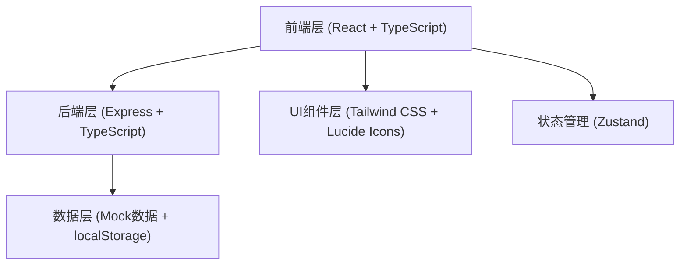
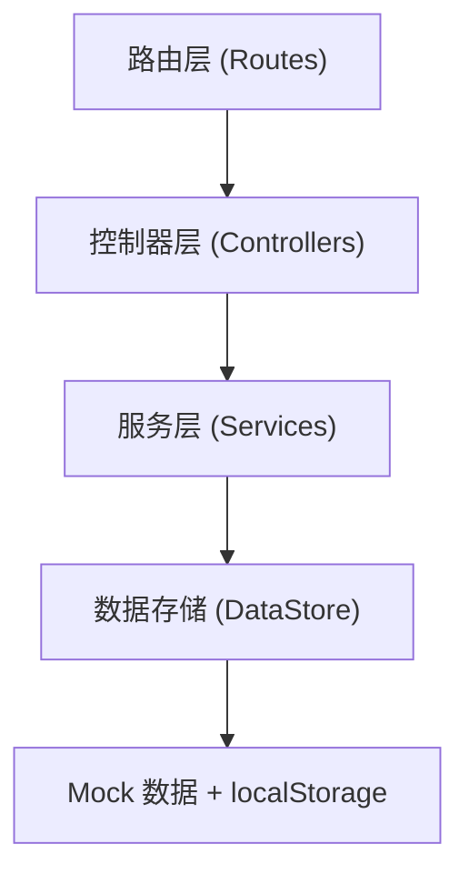
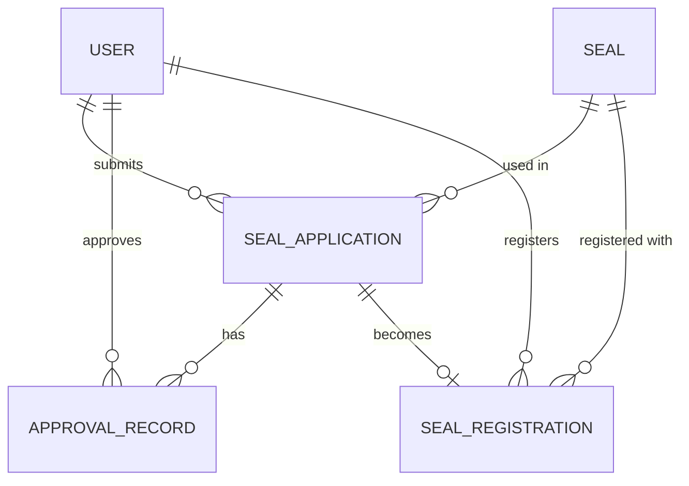

## 1. 架构设计



## 2. 技术说明

- 前端：React@18 + TypeScript + Vite + TailwindCSS@3 + Zustand + React Router Dom
- 后端：Express@4 + TypeScript
- 图标库：lucide-react
- 数据：Mock 数据 + localStorage 持久化
- 初始化工具：vite-init

## 3. 路由定义

| 路由 | 用途 |
|-----|------|
| / | 仪表盘 |
| /applications | 用印申请列表 |
| /applications/new | 新建用印申请 |
| /applications/:id | 申请详情 |
| /approvals | 待我审批列表 |
| /approvals/:id | 审批详情 |
| /seals | 印章效期管理 |
| /seals/new | 印章入库 |
| /registrations | 用印登记列表 |
| /registrations/new | 新建用印登记 |

## 4. API 定义

### 4.1 类型定义

```typescript
// 用户角色
type UserRole = 'employee' | 'dept_head' | 'leader' | 'seal_admin' | 'admin';

// 申请状态
type ApplicationStatus = 'draft' | 'pending_dept' | 'pending_leader' | 'approved' | 'rejected' | 'registered' | 'cancelled';

// 印章状态
type SealStatus = 'stored' | 'in_use' | 'warning' | 'expired' | 'locked';

// 审批节点
type ApprovalNode = 'submitter' | 'dept_head' | 'leader';

// 用印申请
interface SealApplication {
  id: string;
  applicantId: string;
  applicantName: string;
  department: string;
  sealType: string;
  sealId?: string;
  reason: string;
  documentName: string;
  quantity: number;
  urgency: 'normal' | 'urgent' | 'emergency';
  status: ApplicationStatus;
  currentNode: ApprovalNode;
  createdAt: string;
  updatedAt: string;
  approvalTrail: ApprovalRecord[];
}

// 审批记录
interface ApprovalRecord {
  id: string;
  applicationId: string;
  node: ApprovalNode;
  approverId: string;
  approverName: string;
  action: 'approve' | 'reject' | 'submit';
  opinion: string;
  timestamp: string;
}

// 印章批次
interface Seal {
  id: string;
  batchNumber: string;
  sealType: string;
  serialNumber: string;
  receivedDate: string;
  expiryDate: string;
  status: SealStatus;
  custodian: string;
  enableDate?: string;
  remark?: string;
}

// 用印登记
interface SealRegistration {
  id: string;
  applicationId: string;
  sealId: string;
  registrarId: string;
  registrarName: string;
  registrant: string;
  registrantDepartment: string;
  usageTime: string;
  photoEvidence?: string;
  remark?: string;
  createdAt: string;
}
```

### 4.2 API 接口

| 方法 | 路径 | 说明 |
|-----|------|-----|
| GET | /api/applications | 获取申请列表 |
| GET | /api/applications/:id | 获取申请详情 |
| POST | /api/applications | 创建申请 |
| PUT | /api/applications/:id | 更新申请 |
| POST | /api/approvals/:id/approve | 审批通过 |
| POST | /api/approvals/:id/reject | 审批驳回 |
| GET | /api/approvals/pending | 获取待审批列表 |
| GET | /api/seals | 获取印章列表 |
| GET | /api/seals/warnings | 获取临期印章 |
| POST | /api/seals | 新增印章批次 |
| PUT | /api/seals/:id/status | 更新印章状态 |
| GET | /api/registrations | 获取登记列表 |
| POST | /api/registrations | 创建用印登记 |
| GET | /api/stats/dashboard | 获取仪表盘统计数据 |

## 5. 服务器架构图



## 6. 数据模型

### 6.1 实体关系图



### 6.2 数据定义

- **用户表**：id, name, role, department, email
- **用印申请表**：id, applicantId, applicantName, department, sealType, sealId, reason, documentName, quantity, urgency, status, currentNode, createdAt, updatedAt
- **审批记录表**：id, applicationId, node, approverId, approverName, action, opinion, timestamp
- **印章批次表**：id, batchNumber, sealType, serialNumber, receivedDate, expiryDate, status, custodian, enableDate, remark
- **用印登记表**：id, applicationId, sealId, registrarId, registrarName, registrant, registrantDepartment, usageTime, photoEvidence, remark, createdAt
